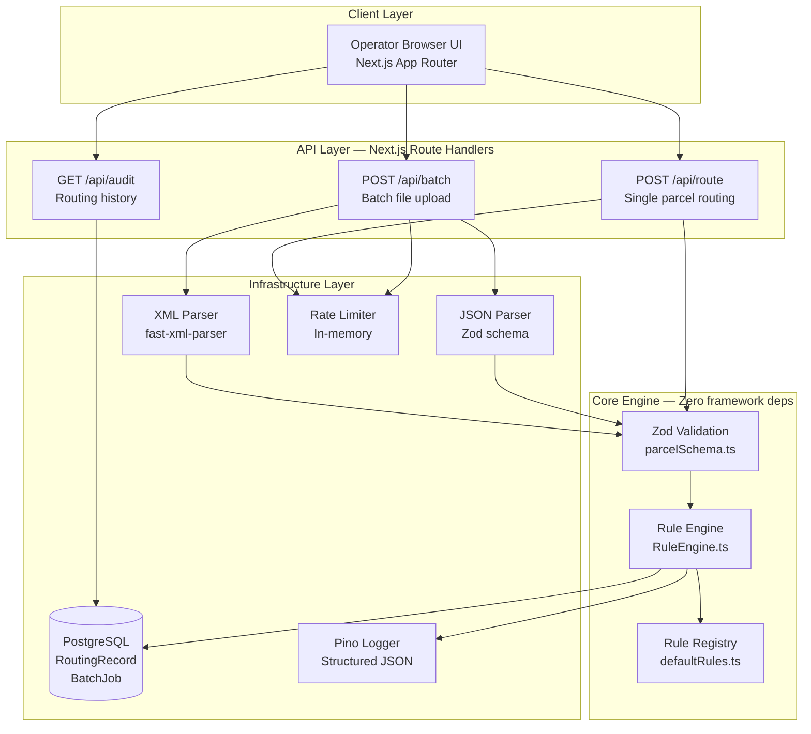

# Architecture Documentation

## Component Diagram



***

## Data Flow — Single Parcel

```
POST /api/route
    │
    ├── 1. Rate limit check (IP-based)
    │       └── 429 if exceeded
    │
    ├── 2. JSON.parse(body)
    │       └── 400 if malformed
    │
    ├── 3. Zod validation (ParcelInputSchema)
    │       └── 400 with field errors if invalid
    │
    ├── 4. RuleEngine.route(parcel)
    │       ├── Sort rules by priority (done at construction)
    │       ├── Find first matching rule
    │       └── Return RouteDecision (never throws — fallback to ManualReview)
    │
    ├── 5. db.routingRecord.create(decision)
    │       └── 500 with correlationId if DB fails
    │
    ├── 6. logger.info(routing_decision event)
    │
    └── 7. Return { parcel, decision, processingMs }
```

***

## Data Flow — Batch Upload

```
POST /api/batch (multipart/form-data)
    │
    ├── 1. Extract file from FormData
    │       └── 400 if no file
    │
    ├── 2. File size check
    │       └── 413 if > MAX_BATCH_FILE_SIZE_MB
    │
    ├── 3. Format detection (.xml / .json / content sniff)
    │
    ├── 4. Parse file → Parcel[]
    │       ├── XML: fast-xml-parser → handle Receipient typo
    │       └── JSON: Zod BatchJsonSchema
    │       └── 422 if no valid parcels found
    │
    ├── 5. db.batchJob.create (status: 'processing')
    │
    ├── 6. RuleEngine.route() for each parcel
    │
    ├── 7. db.routingRecord.createMany (single round-trip)
    │
    ├── 8. db.batchJob.update (status: 'completed')
    │
    └── 9. Return { batchId, totalProcessed, parseErrors, results[] }
```

***

## Rule Engine Design

```
RuleEngine
    │
    ├── constructor(rules: Rule[])
    │       └── sorts by priority ascending (O(n log n), done once)
    │
    └── route(parcel: Parcel): RouteDecision
            │
            ├── rules.find(rule => rule.condition(parcel))
            │       └── O(n) — first match wins
            │
            ├── if matched: return rule.decision(parcel)
            │
            └── if no match: return ManualReview fallback
```

**Why first-match semantics:** Explicit and predictable. Engineers can reason about which rule fires by reading priorities top-to-bottom. Last-match semantics (all rules evaluated, last wins) create hidden override bugs that are hard to debug.

**Why priority is a number not an enum:** Allows inserting a rule between two existing ones (priority 1.5) without renumbering everything. Extensibility-first design.

***

## Database Schema

```
RoutingRecord
├── id          CUID (primary key)
├── createdAt   DateTime (indexed — for time-range queries)
├── weight      Float
├── value       Float
├── destinationCountry  String? (optional — not in current XML schema)
├── recipientName       String? (display only)
├── batchId     String? (foreign key to BatchJob.id)
├── department  String  (indexed — for department filter queries)
├── requiresInsurance   Boolean
├── reason      String  (human-readable routing explanation)
├── appliedRuleLabel    String  (which rule fired)
├── flags       String[] (PostgreSQL array)
├── source      String  ("single" | "batch_xml" | "batch_json")
└── processingMs        Int?    (latency tracking)

BatchJob
├── id          CUID
├── createdAt   DateTime (indexed)
├── filename    String
├── format      String   ("xml" | "json")
├── totalCount  Int
├── successCount Int
├── errorCount  Int
└── status      String   ("processing" | "completed" | "partial" | "failed")
```

**Design choices:**
- `flags` as `String[]` (Postgres array) — queryable without a join table, simple to extend
- `reason` stored in DB — operators can audit decisions without re-running the engine
- `appliedRuleLabel` stored — enables detecting which rule fires most/least often
- `processingMs` stored — enables latency anomaly detection

***

## Security Architecture

```
Internet
    │
    ├── CDN / WAF (future: Cloudflare)
    │
    ├── Load Balancer
    │
    └── Next.js Server
            │
            ├── Security Headers (next.config.ts)
            │   ├── CSP — no inline scripts from external origins
            │   ├── HSTS — force HTTPS
            │   ├── X-Frame-Options — prevent clickjacking
            │   └── X-Content-Type-Options — prevent MIME sniffing
            │
            ├── Rate Limiter (src/lib/security.ts)
            │   └── 100 req/min per IP (configurable via env)
            │
            ├── Input Validation (Zod)
            │   ├── Type checking
            │   ├── Range bounds
            │   └── String length limits
            │
            └── PostgreSQL (private network only in production)
```

***

## Extension Points

| What to extend | Where to change | Effort |
|---|---|---|
| Add a new routing department | `src/core/rules/defaultRules.ts` | 5 min |
| Add a new routing condition | `src/core/rules/defaultRules.ts` | 5 min |
| Change weight thresholds | `src/core/rules/defaultRules.ts` | 2 min |
| Support a new batch file format | `src/lib/parsers/` + new parser | 30 min |
| Add a new flag type | `src/core/engine/types.ts` | 5 min |
| Add DB-stored rules | New `RuleRepository` class | 2 hours |
| Add async batch processing | Replace sync routing with BullMQ | 4 hours |